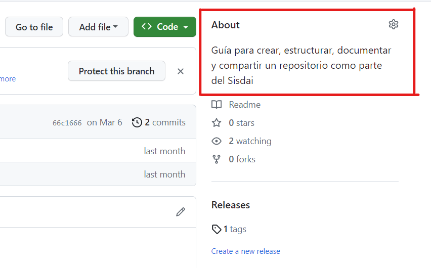
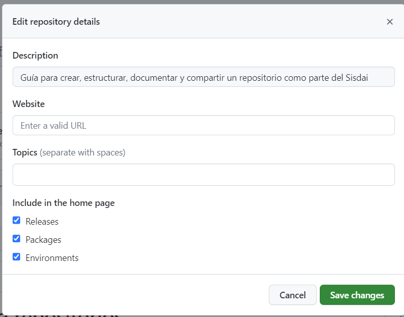
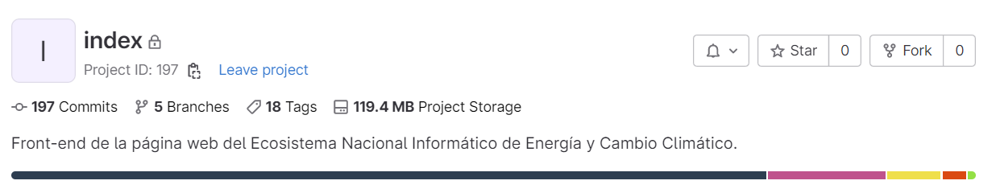
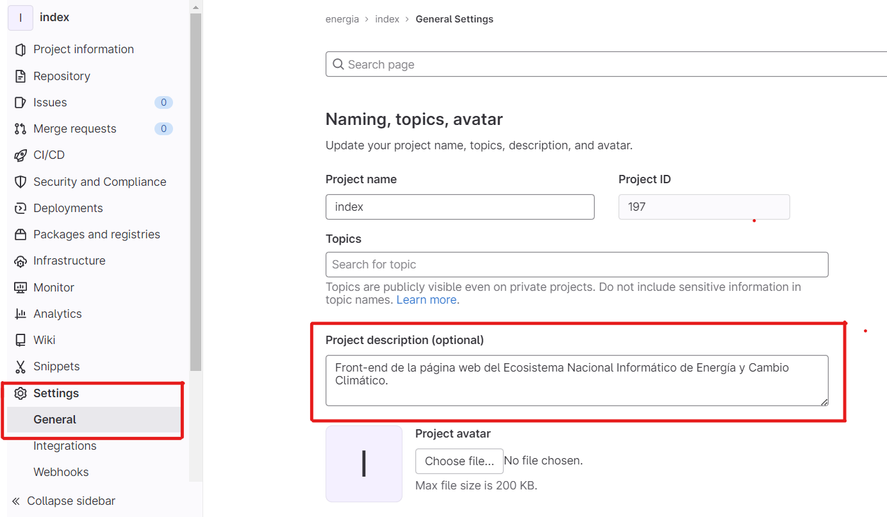

# ¿Cómo hago mi repositorio?

Para que nuestros repositorios utilicen las mejores prácticas y se encuentren correctamente documentados, seguiremos las 
reglas establecidas aquí y que se presentarion en las sesiones de _Versionamiento, repositorios y flujos de trabajo_, 
cuya presentación se puede consultar [aquí](https://www.canva.com/design/DAFcaLWLL_g/sN5NeHunu9H48qLgUptBqQ/view?utm_content=DAFcaLWLL_g&utm_campaign=designshare&utm_medium=link&utm_source=publishsharelink).

Recuerda que la mayoría de los lineamientos y reglas son flexibles. Todo depende del proyecto en el que estés trabajando. 
Sólo ten en mente que tu repositorio debe de tener una estructura, una documentación y sobre todo debe de entenderse.

## Lineamientos generales

### Nombrado

Al nombrar tu repositorio:

- Usa guiones medios como conectores entre palabras.
- El prefijo puede ser el nombre del proyecto. Procura ir de lo general a lo particular.
- Los nombres deben de ser descriptivos, pero concisos.
- No uses preposiciones o artículos (la, de, para).
- Evita anglicismos en la medida de lo posible. Sabemos que al trabajar en el área de las Tecnologías de la Información 
muchas veces esto es imposible. Sin embargo hay que ir empujando cada vez más porque el código y los nombres de las 
tecnologías estén escritas en nuestro idioma para hacerlas más accesibles. Si no lo hacemos nosotras, nadie lo empezará
a hacer.
- Evita nombres de tecnologías en la medida de lo posible.
- No coloques emojis.
- No utilices acentos, la letra _ñ_ o cualquier caracter especial que no se visualice correctamente en un hipervínculo 
de tu navegador.
- No coloques _dai_ o _dadsig_.

#### Ejemplos

| **Así no**                               	| **Así si**                     	|
|------------------------------------------	|--------------------------------	|
| dai-variantes-covid-data                 	| salud-covid-variantes-datos    	|
| vuepress-pruebas                         	| pruebas-vuepress               	|
| conexion-de-api                          	| gema-conexion-api              	|
| dadsig-css                               	| sisdai-css                     	|
| Generacion-de-metadatos-para-capas-geo-🌎 	| generacion-metadatos-capas-geo 	|
| planeas-web                              	| energia-planeas-front          	|

### Contenido del repositorio

#### ¿Qué SÍ lleva mi repo?

- Documentación como archivo _markdown_ y nombrado _README.md_. En la sección de _Documentación_ de este documento te 
damos los lineamientos generales para que puedas redactarla. Así mismo ve a las plantillas de documentación que se 
encuentran en este repositorio para un vistazo más particular de acuerdo al proyecto en el que te encuentres trabajando.
- El apartado de _About_ en GitHub o _Project description_ en GitLab debidamente llenado. Estos dos apartados son una 
descripción muy breve y general del repositorio, generalmente de una o dos oraciones.

En GitHub el apartado de _About_ se puede encontrar en el lado derecho de la interfaz, junto al botón de 
_Code_.

Al dar clic en el ícono del engrane al lado de _About_ se abre una ventana emergente para editar el campo.

En GitLab el apartado de _Project description_ se visualiza en la parte superior del repositorio:

Para editarlo hay que dar click en la barra lateral izquierda, primero en _Settings_, luego en 
_General_y se desplegarán del lado derecho los campos para editar los datos del repositorio.

#### ¿Qué NO debe de llevar mi repo?

- No debe de contener credenciales, ya sea de bases de datos, tokens de API, etc. Tanto en el código, como en archivos 
independientes.
- No debe de contener datos originales del proyecto. Recuerda que los datos se analizan, limpian y procesan antes de que 
sean liberados al público usuario. Una excepción de datos originales son los datos auxiliares, como pueden ser archivos 
con claves geoestatales, datos de población local o mundial, etc.
- No se deben de versionar archivos de sistema, p.e. __MACOSX_, _ipynb_checkpoints_, _.idea_, etc.

#### Consideraciones importantes

- Archiva los repositorios deprecados. Si identificas que un repositorio se volvió obsoleto o ya no se le ha dado 
continuidad, es una buena práctica archivarlos (no borrarlos). Si no tienes permiso para hacerlo puedes abrir un issue
en el repo (ver sección de _Contribuciones_ en este proyecto) y asignar a una persona con permisos de _Maintainer_.
- Añade los nuevos repositorios que hagas en el inventario interno de repositorios que se habilitará proximamente.

## Documentación 

### Estructura mínima

De manear general la documentación de los repositorios debe de tener un tronco común, pero esto dependerá del proyecto 
en el que estes trabajando. En este proyecto se añaden plantillas de documentación para algunos proyectos, como son los 
el front-end de los ENI. Puedes consultarlas en la carpeta _plantillas_.
La documentación la debes de redactar en el archivo _README.md_. Puedes ir al documento _README_ejemplo.md_
de este repositorio para ver un ejemplo de la estructura mínima y reglas más detalladas de las secciones que se 
listan a continuación.

- Título. Puede ser el nombre del repositorio o del proyecto.
- Descripción general del repositorio.
- Introducción, mencionando el objetivo, resultados, casi como un _abscract_. Evita usar las palabras _DAI_,
  _Dadsig_. Sí puedes usar _Gema_, _Sisdai_, _ENI_.
- Limitación de responsabilidad. Esta parte sólo la colocarás en caso de que el proyecto se libere al público aún en desarrollo o se socialice de
  manera "no oficial"
- Requerimientos o dependencias.
- Instrucciones de instalación y/o uso.
- Licencia (SALSA).
- Contribución (SALSA).

También de manera opcional y en medida de lo posible puedes incluir [badges](https://shields.io/).

### Tipos de repositorios

Recordemos que los repositorios nos sirven para versionar nuestro código, pero al mismo tiempo también son una 
herramienta para socializar el trabajo del equipo y por lo tanto la documentación debe estar dirigida al público usuario
del repositorio (además de las personas desarrolladoras).

Por lo anterior y de acuerdo a nuestra experiencia, definimos los siguientes tipos de repositorios de acuerdo al 
público usuario:

- herramientas para personas desarrolladoras
- herramientas para personas analistas
- socialización de los ENI

## Versionamiento semántico (en construcción)

## Flujo entre ramas (en construcción)

## Contribuir a este repositorio

Para contribuir a este proyecto de buenas prácticas, hazlo usando los lineamientos de SALSA, que puedes consultar
[aquí](https://salsa.crip.conacyt.mx/guidelines/contribute/)*. De la misma manera, puedes consultar las siguientes 
fuentes de información para conocer más acerca de como contribuir a los proyectos.

- [Contribuir a proyectos](https://docs.github.com/es/get-started/quickstart/contributing-to-projects)
- [Creating an issue](https://docs.github.com/en/issues/tracking-your-work-with-issues/creating-an-issue)

*En los lineamientos de contribución se lista la rama _master_ se lista como principal, sin embargo en este proyecto,
dicha rama es _main_.

